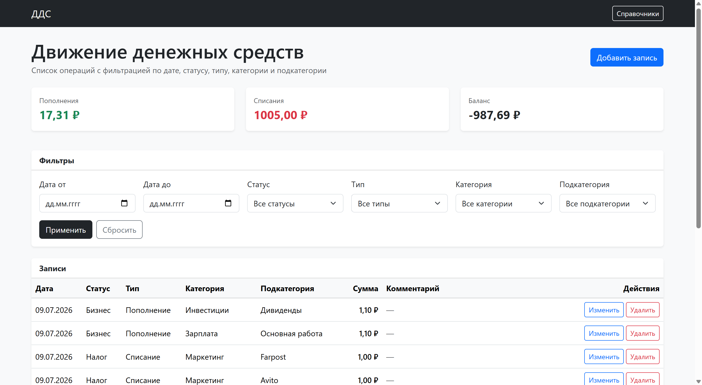
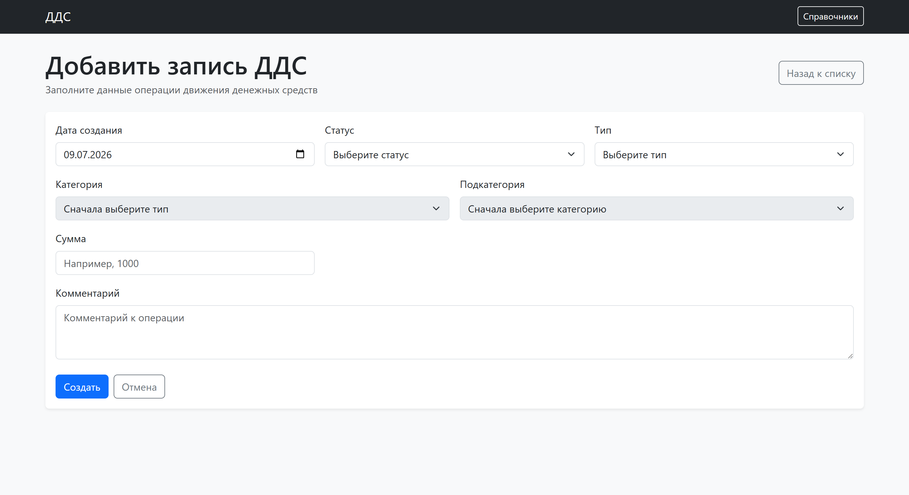
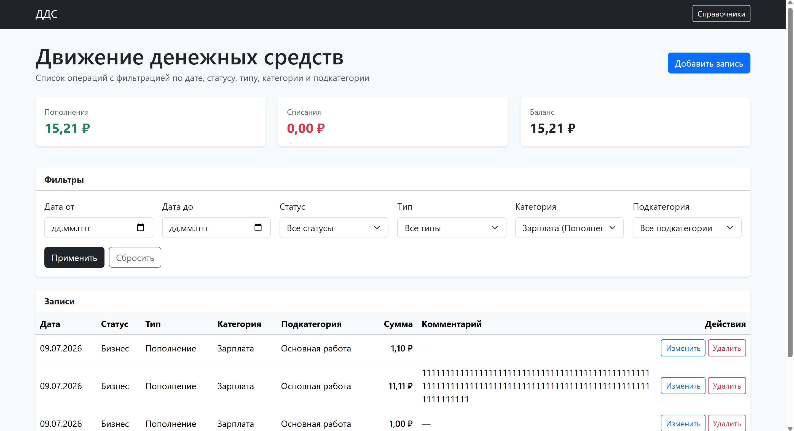
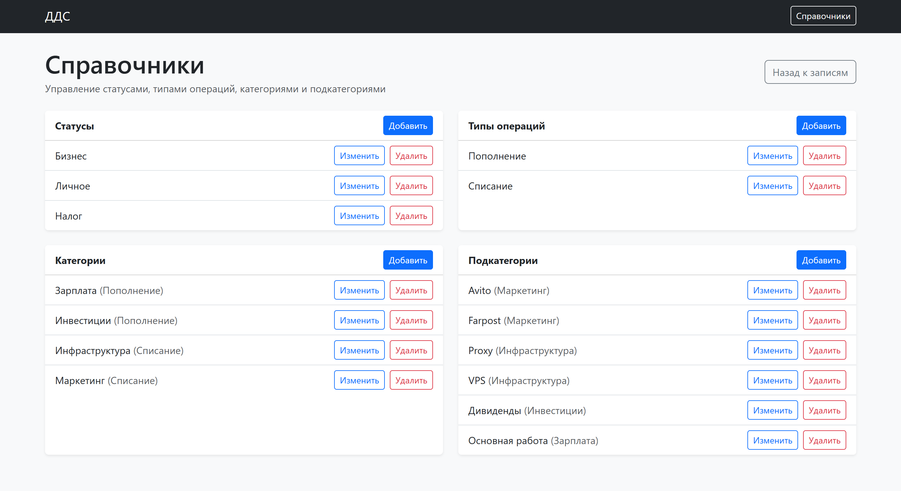
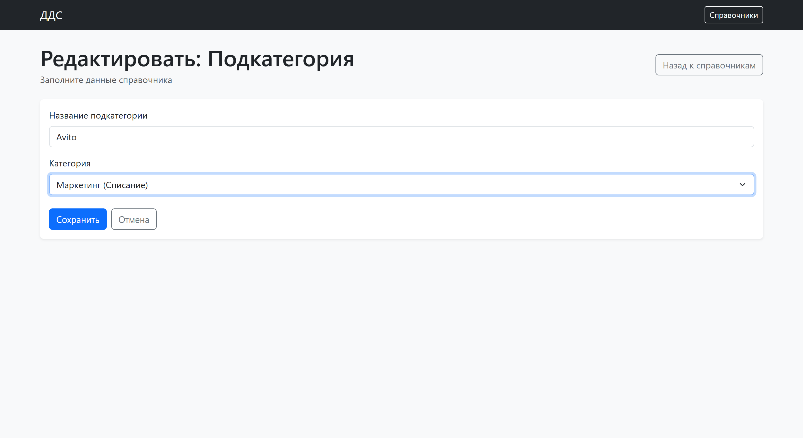

# Веб-сервис для управления движением денежных средств

Веб-приложение для учёта, управления и анализа движения денежных средств.

Проект реализован на Django с использованием Django ORM, Django REST Framework, django-filter, SQLite и Bootstrap.

## Возможности

- Создание, просмотр, редактирование и удаление записей ДДС.
- Фильтрация записей по:
  - дате;
  - статусу;
  - типу операции;
  - категории;
  - подкатегории.
- Управление справочниками:
  - статусами;
  - типами операций;
  - категориями;
  - подкатегориями.
- Настройка логических зависимостей:
  - категории привязаны к типам операций;
  - подкатегории привязаны к категориям.
- Динамическое обновление категорий и подкатегорий на форме создания/редактирования записи.
- Серверная валидация данных.
- Проверка корректности связей:
  - нельзя выбрать категорию, которая не относится к выбранному типу;
  - нельзя выбрать подкатегорию, которая не относится к выбранной категории.
- Отображение итогов:
  - сумма пополнений;
  - сумма списаний;
  - баланс.

## Используемые технологии

- Python
- Django
- Django ORM
- Django REST Framework
- django-filter
- SQLite
- Bootstrap 5
- JavaScript

## Запуск проекта

### 1. Клонировать репозиторий

```bash
git clone <ссылка-на-репозиторий>
cd dds_service
```

### 2. Создать виртуальное окружение

```bash
python -m venv venv
```

### 3. Активировать виртуальное окружение

Для Windows PowerShell:

```powershell
.\venv\Scripts\activate
```

Для Windows CMD:

```cmd
venv\Scripts\activate
```

Для Linux/macOS:

```bash
source venv/bin/activate
```

После активации в начале строки терминала должно появиться:

```text
(venv)
```

### 4. Установить зависимости

```bash
pip install -r requirements.txt
```

### 5. Выполнить миграции

```bash
python manage.py migrate
```

### 6. Создать суперпользователя

```bash
python manage.py createsuperuser
```

### 7. Запустить сервер

```bash
python manage.py runserver
```

После запуска приложение будет доступно по адресу:

```text
http://127.0.0.1:8000/
```

Админ-панель доступна по адресу:

```text
http://127.0.0.1:8000/admin/
```

## Основные страницы

- `/` — список записей ДДС.
- `/records/create/` — создание записи ДДС.
- `/records/<id>/edit/` — редактирование записи ДДС.
- `/records/<id>/delete/` — удаление записи ДДС.
- `/refs/` — управление справочниками.
- `/admin/` — административная панель Django.

## API

В проекте используется Django REST Framework для получения зависимых списков.

### Получение категорий по типу операции

```text
/api/categories/?operation_type=<id>
```

### Получение подкатегорий по категории

```text
/api/subcategories/?category=<id>
```

Эти API используются на форме создания и редактирования записи ДДС для динамического обновления списков.

## Модели данных

### Status

Справочник статусов записи.

Примеры:

- Бизнес
- Личное
- Налог

### OperationType

Справочник типов операций.

Примеры:

- Пополнение
- Списание

### Category

Справочник категорий.

Категория привязана к типу операции.

Примеры:

- Инфраструктура — Списание
- Маркетинг — Списание
- Зарплата — Пополнение
- Инвестиции — Пополнение

### Subcategory

Справочник подкатегорий.

Подкатегория привязана к категории.

Примеры:

- VPS — Инфраструктура
- Proxy — Инфраструктура
- Farpost — Маркетинг
- Avito — Маркетинг
- Основная работа — Зарплата
- Дивиденды — Инвестиции

### CashFlowRecord

Основная модель записи движения денежных средств.

Поля:

- дата создания;
- статус;
- тип операции;
- категория;
- подкатегория;
- сумма;
- комментарий.

## Бизнес-правила

В проекте реализованы следующие проверки:

- сумма операции должна быть больше нуля;
- категория должна относиться к выбранному типу операции;
- подкатегория должна относиться к выбранной категории;
- используемые справочники нельзя удалить, если они уже связаны с записями ДДС.

## Стартовые данные

После запуска проекта справочники можно создать вручную через страницу:

```text
http://127.0.0.1:8000/refs/
```

Также справочники можно создать через админ-панель:

```text
http://127.0.0.1:8000/admin/
```

Рекомендуемый набор стартовых данных:

### Статусы

- Бизнес
- Личное
- Налог

### Типы операций

- Пополнение
- Списание

### Категории

- Инфраструктура — Списание
- Маркетинг — Списание
- Зарплата — Пополнение
- Инвестиции — Пополнение

### Подкатегории

- VPS — Инфраструктура
- Proxy — Инфраструктура
- Farpost — Маркетинг
- Avito — Маркетинг
- Основная работа — Зарплата
- Дивиденды — Инвестиции

## Комментарий по базе данных

Проект использует SQLite для упрощения запуска тестового задания.

Файл базы данных `db.sqlite3` не обязателен для передачи в репозиторий, так как база создаётся после выполнения миграций.

## Скриншоты интерфейса

### Главная страница со списком записей



### Форма добавления записи



### Фильтрация записей



### Управление справочниками



### Редактирование подкатегории

